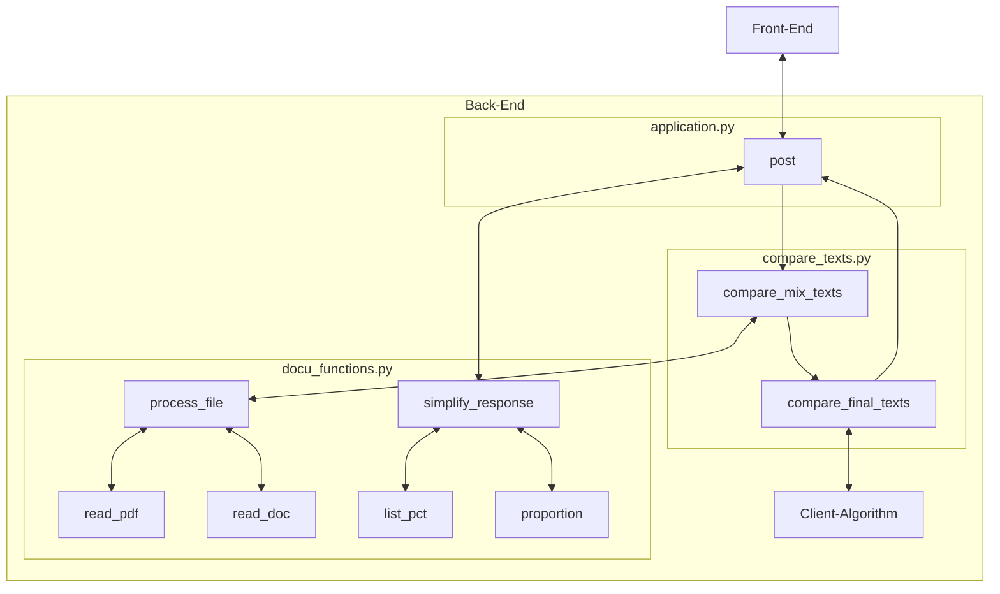

# AuthoWrite Back-End

*Created for the COMP30022 IT Project subject*

*Futher documentation can be found on the [front-end](https://github.com/Re-Roll/AuthoWrite-front-end)*

- [AuthoWrite Back-End](#authowrite-back-end)
    - [Members](#members)
  - [Description](#description)
  - [Key Classes \& Application Layers](#key-classes--application-layers)
      - [Algorithm Changes Made:](#algorithm-changes-made)
  - [How To Use](#how-to-use)
  - [Installation Method](#installation-method)
  - [Deployment Method](#deployment-method)

### <u>Members</u>

[`Adrian Podiono`](https://www.linkedin.com/in/adrian-podiono-787367246)  [`Hanizam Zaharyudin`](https://www.linkedin.com/in/hanizam-zaharyudin-1a5124198)  [`Jia Jie Zheng`](https://www.linkedin.com/in/thomas-zheng-7622a2190/)  [`Lin Xin Xie`](https://www.linkedin.com/in/linxx/)  [`Saaiq Ahmed`](https://www.linkedin.com/in/saaiq-ahmed-364b5a219/)

## Description

*test cases are all within the file `flask_test.py` which uses files within test_files/*

This is the Flask Web API repository which is used to input and process strings, `.txt`, `.pdf` and `.docx` files to output an estimated Authorship score. 

- *A score on the likelihood percentage chance that an unknown text was written by the author of the known texts, assuming all the known texts were written by the same individual*

All files are converted into strings and pipelined into the **Authorship Algorithm** supplied to us by our client [Eduardo Oliveira](https://www.eduoliveira.com/).

- *The given algorithm was simplified as the model used isn't being trained and only used*
- *The algorithm was also improved upon after errors were noticed which was done with the permission of our client*

## Key Classes & Application Layers



<u>**Classes**</u>

**Compare** : Class function which handles all requests for the comparison of an unknown text with known texts

<u>**Algorithms**</u>

`Compare: post()` : Method in `Compare` class to handle POST request. Takes in a multi-part form which follows the `compare_model` and outputs a score and statistics after processing through the client's algorithm which is outputted following the `score_model` as a JSON response

`compare_mix_texts()` : Takes in a mix of known and unknown files and texts and outputs the score and raw stats through the `compare_final_texts()` function.

`simplify_response()` : Takes an input of the raw statistics of all the texts and outputs a simplified response to be used by the front end.

`compare_final_texts()` : Takes an input of an `unknown_text` (data type: `string`) and `known_texts` (data type: `List[string]`) to be preprocessed by the models trained and saved based on what the client provided. Which then outputs the score and raw stats.

`get_vectors()` : Helper function that uses the **Word2Vector Model** to vectorise the texts and obtain key features.

#### Algorithm Changes Made:
1. Edited `get_vectors()` to output text style information
2. Fixed `calculate_style_vector()` to not divide `avg_sentence_length` and `ttr` by `word_count`
   1. Edited to output `word_count` as well
3. Fixed `analyze_sentence_lengths()` to properly obtain a list of sentence lengths

Alongside the score, the algorithm also outputs extra data about the unknown and known texts which is used by the algorithm in determining Authorship score. The extra data is supplied for the user's insight as to why the model may have given the score it did.

## How To Use 

Documentation of the deployed API is available with the link here: [AuthoWrite Back-End API Documentation](http://3.26.213.177:5000/docs)

There is only 1 main function under `/compare` as a `POST` request which takes in a multi-part form and outputs a JSON response. The multi-part form is ensured to include the headers:

<u>**Compare Model**</u>

- `"known_texts"` *(Required)* : `List` of known texts (of type `str`) to compare against
- `"unknown_text"` : an unknown text (of type `str`) to compare against
- `"known_files"` *(Required)* : `List` of known files (of type `file`) to compare against
- `"unknown_file"` : unknown file (of type `file`) to compare against

    - *Where `"unknown_file"` takes priority over `"unknown_text"`*

This then outputs a JSON response:

<u>**Score Model**</u>

*Where every header is (Required) and is of the type `List[float]` in the form [unknown_value, known_value, unknown_proportion]*

- `"w_sim"` : Word Similarity
- `"punct_p"` : Punctuation Proportion
- `"avg_sent_l"` : Average Sentence Length
- `"rare_word_p"` : Rare Words Proportion
- `"long_word_p"` : Long Words Proportion
- `"ttr"` : Type Token Ratio
- `"word_count"` : Word Count
- `"score"` : Final Authorship Score

Both models have further explanations in the API docs which can also be found in the `application.py` file. 

## Installation Method

1. Clone the repository
2. Make sure to have [python](https://www.python.org/) installed with [pip](https://pypi.org/project/pip/)
3. Run the commands below to get the back end working:

```
pip install -r requirements.txt
python -c 'import nltk; nltk. download(["punkt", "stopwords","wordnet"])'
export FLASK_APP=application.py
flask run --host=0.0.0.0
```

The command in line 2 is also only needed once as attempting to redownload is unneccessary computing.

## Deployment Method

The deployment was done as an **EC2 Instance** on AWS.
The server was setup manually at the start to install both `git` and `python3`. So that the repository could then be cloned to the EC2 Instance and run.

To ensure CI/CD, a script was setup to check for any changes to the main branch of the github and then rerun the process.

The code used for the deployment after the initial setup was:

    git pull
    pip install -r requirements.txt
    python -c 'import nltk; nltk. download(["punkt", "stopwords","wordnet"])'
    export FLASK_APP=application.py
    nohup flask run --host=0.0.0.0


Which is very similar to the installation process with the addition of `git pull` and `nohup`. Where `nohup` allows for the application to run in the EC2 instance continuously even when the terminal is closed. The command in line 3 is also only needed once as stated in [Installation Method](#installation-method)